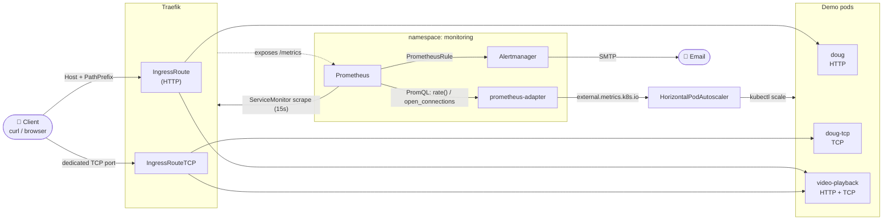
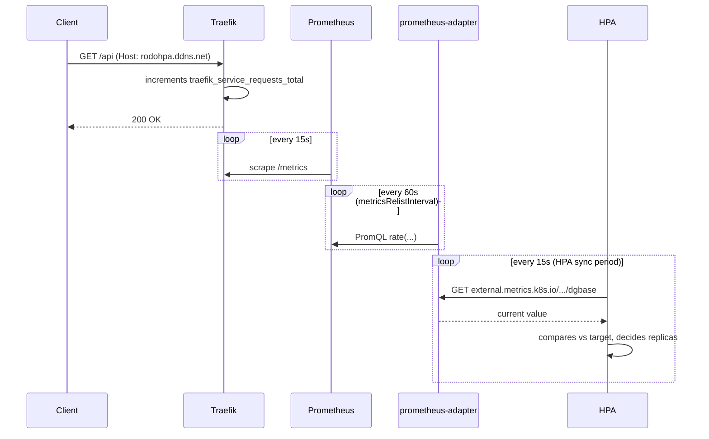

<div align="center">

# Traefik + Prometheus Adapter + HPA

**Kubernetes autoscaling driven by business metrics (HTTP request rate and TCP connection count), not CPU/memory.**

[🇪🇸 Español](README.md) | 🇬🇧 English


</div>

---

## Table of contents

- [Description](#description)
- [Demo / Screenshots](#demo--screenshots)
- [Key features](#key-features)
- [Tech stack](#tech-stack)
- [Architecture](#architecture)
- [Exposed metrics](#exposed-metrics)
- [Project structure](#project-structure)
- [Installation and usage](#installation-and-usage)
- [Technical decisions](#technical-decisions)
- [Additional documentation](#additional-documentation)
- [Author and contact](#author-and-contact)

---

## Description

Kubernetes scales workloads based on CPU and memory by default, but a lot of real services don't actually saturate on that — they saturate on **request rate** or on **concurrent connection count**. This project wires up that full chain: **Traefik**, acting as the Ingress Controller, emits Prometheus metrics for every router and service it proxies; **Prometheus** scrapes them; **prometheus-adapter** translates those metrics (via PromQL) into the format Kubernetes understands (`external.metrics.k8s.io`); and the **HorizontalPodAutoscaler** reads them to decide how many replicas each Deployment needs.

The repo ships three demo services that cover the three possible traffic patterns — HTTP-only, TCP-only, and HTTP+TCP combined in the same pod — each with a "base" (shared/corporate) instance and a "client" instance (isolated, similar to a multi-tenant setup). It also includes Prometheus alerting with real email notifications when traffic crosses a threshold, plus an interactive CLI to install, upgrade, inspect and tear down the whole stack.

It's designed to run against either a real **GKE** cluster or a **local `kind`** cluster, with scripts included to reproduce the end-to-end behavior without depending on real external traffic.

## Demo / Screenshots

<table>
<tr>
<td width="50%">

**Traefik — Dashboard**

Active entrypoints and router/service/middleware health, HTTP and TCP.

</td>
<td width="50%">

**Traefik — HTTP Routers**

The live `Host` + `PathPrefix` routing rules.

</td>
</tr>
<tr>
<td width="50%">

**Traefik — TCP Routers**

One dedicated TCP entrypoint per service/variant.

</td>
<td width="50%">

**Prometheus — Target health**

Traefik's `ServiceMonitor` scrape, `UP`.

</td>
</tr>
<tr>
<td width="50%">

**Prometheus — TCP connections**

`traefik_open_connections` live while test connections are generated.

</td>
<td width="50%">

**Prometheus — HTTP request rate**

`rate(traefik_service_requests_total[2m])` per host.

</td>
</tr>
<tr>
<td width="50%">

**Prometheus — Alert firing**

`HighHttpRateV1` in `FIRING` state, with the exact PromQL expression that triggers it.

</td>
<td width="50%">

**Alertmanager — Notification**

The same alert, already routed to the email receiver.

</td>
</tr>
<tr>
<td width="50%">

**CLI — HPA live**

`kubectl get hpa` showing real values (not `<unknown>`) and replicas scaling.

</td>
<td width="50%">

**CLI — Interactive menu**

`scripts/init.sh`: install, view metrics, tear down — all from one menu.

</td>
</tr>
</table>

## Key features

- 🔀 **Native HTTP and TCP routing** on the same Ingress Controller (Traefik), no extra components needed.
- 📈 **Autoscaling driven by business metrics** — requests per second and concurrent TCP connections — instead of CPU/memory.
- 🧩 **Three service patterns covered**: HTTP-only, TCP-only, and HTTP+TCP combined in a single pod, to compare how the HPA behaves in each case.
- 🏢 **Multi-instance scheme**: every service has a base (shared/corporate) instance and an isolated client instance, on the same infrastructure.
- 🔔 **Alerts with real email notifications** when traffic crosses a threshold (Prometheus + Alertmanager + SMTP).
- 🖥️ **Interactive CLI** (`scripts/init.sh`) to install, upgrade, inspect metrics and tear down the whole stack.
- 🌍 **Multi-environment** (`beta` / `candidate` / `prod`) on the same cluster, isolated by namespace.
- 🧪 **Traffic generator script** included, to reproduce the end-to-end behavior without depending on real external traffic.

## Tech stack

| Technology | Version | Purpose |
|---|---|---|
| Kubernetes | 1.29+ (tested on GKE and `kind`) | Cluster orchestration |
| Helm | 3.15+ | Manages the Traefik and Prometheus charts |
| Traefik | chart `32.1.1` / app `v3.1.6` | HTTP + TCP Ingress Controller, Prometheus metrics emitter |
| kube-prometheus-stack | — | Prometheus Operator + Alertmanager, via `ServiceMonitor`/`PrometheusRule` CRDs |
| prometheus-adapter | `v0.12.0` | Translates PromQL into the Kubernetes External Metrics API |
| Bash | — | Install, teardown and testing automation |
| jq | — | JSON parsing in the CLI |

> The Traefik version is explicitly pinned in the install script: the `values.yaml` uses fields that newer chart schema versions no longer accept, so it's pinned to avoid breaking when pulling "latest" from the Helm repo.

## Architecture



**Lifecycle of one HTTP request**, from arrival to potentially affecting the HPA:



## Exposed metrics

This project doesn't have its own REST API — what it exposes is a **Kubernetes metrics API** (`external.metrics.k8s.io`), which is what every HPA consumes. There are 8 metrics in total:

| Metric | Type | Service | HPA reading it |
|---|---|---|---|
| `dgbase` / `dgvideotest` | HTTP (request rate) | `doug` (base / client) | `hpa-doug` / `hpa-doug-videotest` |
| `dgtcpbase` / `dgtcpvideotest` | TCP (open connections) | `doug-tcp` (base / client) | `hpa-doug-tcp` / `hpa-doug-tcp-videotest` |
| `pbtcpbase` / `pbtcpvideotest` | TCP (open connections) | `video-playback` (base / client) | `hpa-video-playback-tcp` / `hpa-video-playback-videotest-tcp` |
| `pbbase` / `pbvideotest` | HTTP (request rate) | `video-playback` (base / client) | *(available, no dedicated HPA)* |

Full reference with the exact PromQL for each one in **[`docs/metrics-reference.en.md`](docs/metrics-reference.en.md)**.

## Project structure

```text
.
├── 0-configmap/         # prometheus-adapter PromQL rules (one per HTTP/TCP metric)
├── 1-helm-values/        # values.yaml for Traefik, kube-prometheus-stack and prometheus-adapter
├── 2-apiservice/         # external.metrics.k8s.io APIService, pre-registered before the first install
├── 3-middleware/         # Traefik Middleware (rate limiting on the HTTP routes)
├── 4-ingress/            # IngressRoute (HTTP) and IngressRouteTCP (TCP)
├── 5-hpa/                 # One HorizontalPodAutoscaler per Deployment
├── 6-app/                 # 3 demo services, each with a base + client instance
│   ├── doug/               #   HTTP only
│   ├── doug-tcp/           #   TCP only
│   └── video-playback/     #   HTTP + TCP in the same pod
├── 7-rules/               # PrometheusRule: alert on HTTP request rate
├── docs/                   # Diagrams and screenshots used in this README
├── scripts/                # Install, teardown, metrics and traffic-generation CLI
├── LICENSE
└── README.md
```

## Installation and usage

### Prerequisites

- `kubectl` and `helm` (3.15+)
- `jq` (the CLI installs it automatically if missing)
- A Kubernetes cluster: a real **GKE** cluster, or **`kind`** for local testing
- If using GKE: `gcloud` authenticated, with `kubectl` pointing at the right context

### 1. Clone the repository

```bash
git clone https://github.com/RodolGiaco/traefik-prometheus-hpa
cd traefik-prometheus-hpa
```

### 2. Spin up the cluster (pick one)

**Option A — local cluster with `kind`** (to try the whole flow without real infrastructure):
```bash
kind create cluster --name rodo
```

**Option B — real GKE**: point `kubectl` at the cluster context (`kubectl config use-context <context>`).

### 3. Install Traefik + Prometheus + HPA

```bash
chmod +x scripts/init.sh
./scripts/init.sh
```

Choose `1) install traefik/prometheus/hpa` and then the environment (`beta`/`candidate`/`prod` — these are namespaces, not separate clusters). The script installs Traefik, Prometheus + Alertmanager + prometheus-adapter, and applies the HPAs and demo pods.

### 4. Map the test domains (only for local `kind`)

Since `kind` has no real LoadBalancer, you reach it through the node's IP + the `nodePort` Kubernetes assigns. The example domains (`rodohpa.ddns.net`, `rodohpaclient.ddns.net`) are free domains created on [No-IP](https://www.noip.com/) — to reproduce the real behavior of a `Host` header, map them to the node's IP in your `/etc/hosts`:

```bash
NODE_IP=$(kubectl get nodes -o jsonpath='{.items[0].status.addresses[?(@.type=="InternalIP")].address}')
echo "$NODE_IP rodohpa.ddns.net" | sudo tee -a /etc/hosts
echo "$NODE_IP rodohpaclient.ddns.net" | sudo tee -a /etc/hosts
```

### 5. Generate test traffic

```bash
./scripts/gen_traffic_doug.sh
```

Sends an HTTP request every second and opens persistent TCP connections against the demo services — this is what makes the HPA stop showing `<unknown>` and start reading real values.

### 6. Watch the HPA scale live

```bash
kubectl get hpa -n beta -w
```

### 7. Open the dashboards

```bash
# Traefik
kubectl port-forward -n beta $(kubectl get pods -n beta -l app.kubernetes.io/name=traefik -o jsonpath="{.items[0].metadata.name}") 9000:9000
# -> http://localhost:9000/dashboard/

# Prometheus
kubectl port-forward -n monitoring svc/prometheus-operated 9090:9090
# -> http://localhost:9090

# Alertmanager
kubectl port-forward -n monitoring svc/prometheus-operator-kube-p-alertmanager 9093:9093
# -> http://localhost:9093
```

### 8. Query the custom metrics via CLI

```bash
./scripts/external_metrics.sh beta
```

Interactive menu to query `external.metrics.k8s.io` directly — 8 metrics exposed by the adapter: `dgbase`, `dgvideotest`, `dgtcpbase`, `dgtcpvideotest`, `pbtcpbase`, `pbtcpvideotest` each have an active HPA reading them; `pbbase` and `pbvideotest` (HTTP rate for `video-playback`) are defined and available to wire up to their own HPA if that service ever needs to scale on that axis too.

## Technical decisions

**Why Traefik instead of another Ingress Controller?** It exposes native Prometheus metrics per router, service and entrypoint without needing an extra exporter, and it supports native TCP routing (`IngressRouteTCP`) in addition to HTTP — necessary to demonstrate scaling by TCP connections, not just HTTP requests, with the same controller.

**Why `prometheus-adapter` instead of KEDA or another alternative?** To show Kubernetes' standard mechanism (`external.metrics.k8s.io`) without depending on a third-party operator — the full pipeline, PromQL → metrics API → HPA, stays explicit and is portable to any cluster running Prometheus Operator.

**Why three separate demo services instead of one?** Each one covers a different traffic pattern (HTTP-only, TCP-only, HTTP+TCP combined) to compare how autoscaling behaves in each case. A single Deployment can only be the `scaleTargetRef` of **one HPA** — if a service needs to scale on two metrics at once (say, HTTP and TCP), those metrics have to live as two entries inside the *same* HPA object, not as two separate HPAs.

**Why a ConfigMap with PromQL rules instead of annotations or a metrics CRD?** `prometheus-adapter` resolves declarative `externalRules` against Prometheus at query time — this makes it possible to tune the PromQL (filters, aggregations, `rate()` windows) without touching code or recompiling anything, and to version it alongside the rest of the cluster.

**Why namespaces per environment instead of separate Helm releases?** It keeps a single, reusable Traefik/Prometheus release per environment, isolating `beta`/`candidate`/`prod` by namespace instead of multiplying full stack installs.

## Additional documentation

- **[`docs/metrics-reference.en.md`](docs/metrics-reference.en.md)** — full reference table of the 8 custom metrics, with the exact PromQL for each one.
- **[`docs/troubleshooting.en.md`](docs/troubleshooting.en.md)** — non-obvious Traefik/Prometheus/`prometheus-adapter` behaviors worth knowing before touching the config (one HPA per Deployment limit, metric discovery timing, etc.).

## Author and contact

**Rodolfo Giacomodonatto**
GitHub: [@RodolGiaco](https://github.com/RodolGiaco)

---

<div align="center">
<sub>Licensed under <a href="LICENSE">MIT</a>.</sub>
</div>
