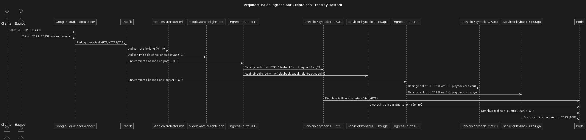

# Traefik Prometheus HPA

Este repositorio proporciona una configuración para instalar y configurar Traefik y Prometheus en un clúster de Kubernetes, junto con reglas de enrutamiento y autoescalado basado en métricas personalizadas.

## Requisitos

- Kubernetes Cluster
- Helm
- Kubectl
- Docker

## Instalación

1. **Clonar el repositorio**
```bash
   git clone https://github.com/RodolGiaco/traefik-prometheus-hpa
   cd traefik-prometheus-hpa
```
2. **Ejecutar el script de configuración**

```bash
chmod +x config.sh
./config.sh
```

El script `config.sh` realiza las siguientes acciones:
- Instala Traefik usando Helm.
- Aplica las configuraciones de middleware e ingress.
- Instala Prometheus y sus configuraciones relacionadas.

## Acceder al Dashboard de Traefik

```bash
kubectl port-forward $(kubectl get pods --namespace beta -l "app.kubernetes.io/name=traefik" -o jsonpath="{.items[0].metadata.name}") 9000:9000 --namespace beta
```

Luego, abre tu navegador y accede a [http://localhost:9000/dashboard/](http://localhost:9000/dashboard/).

## Ver las Métricas de Traefik

```bash
kubectl port-forward $(kubectl get pods --namespace beta -l "app.kubernetes.io/name=traefik" -o jsonpath="{.items[0].metadata.name}") 9100:9100 --namespace beta
```

Luego, abre tu navegador y accede a [http://localhost:9100/metrics](http://localhost:9100/metrics).

## Ver Métricas Personalizadas

Verificación de métricas externas para el servicio de video llamado `video-playback`:

```bash
kubectl get --raw "/apis/external.metrics.k8s.io/v1beta1/namespaces/beta/pbtcpvideotest"
kubectl get --raw "/apis/external.metrics.k8s.io/v1beta1/namespaces/beta/pbtcpbase"
kubectl get --raw "/apis/external.metrics.k8s.io/v1beta1/namespaces/beta/pbvideotest"
kubectl get --raw "/apis/external.metrics.k8s.io/v1beta1/namespaces/beta/pbbase"
```
## Diagrama de Secuencia



## Infraestructura

- **Ingress-Controller**: Traefik.
- **Generación de métricas**: Prometheus-Adapter, basado en la cantidad total de solicitudes HTTP y conexiones simultáneas TCP.
- **Servicios**:
    - **doug**: Solo HTTP.
    - **doug-tcp**: Solo TCP.
    - **video-playback**: HTTP y TCP.
- **Clusters**: GKE (Google Kubernetes Engine).
- **Load Balancer**: Apunta a los puertos de los servicios.

## Funcionamiento

### Rutas de Ingress

- **IngressRoute** y **IngressRouteTCP** apuntan a los servicios tipo NodePort para HTTP y TCP respectivamente.

#### Enrutamiento HTTP

- Dominios: `playback.sitrack.io` y `playback.videotest.sitrack.io`.
- Contextos:
    - `/playback`: Para el servicio video-playback.
    - `/api`: Para el servicio doug.

#### Enrutamiento TCP

- Basado en puertos para los servicios TCP.

### Flujo de Solicitudes

- **video-playback**: Recibe solicitudes HTTP del cliente y paquetes TCP del equipo.
    - Recursos HTTP: `getCalendar`, `queryFileList`, `downloadVideoResource`.
    - Las solicitudes pasan por Traefik antes de llegar al servidor HTTP o TCP de video-playback.
- **doug**: Maneja solo solicitudes HTTP del equipo.
- **doug-tcp**: Maneja solo paquetes TCP del equipo.

### Proceso de Transacciones

- **Linguo**: Gateway que se hace conexion con el equipo y recibe las tramas
- **n9m**: Servicio que llama al recurso de transacción de Linguo y crea la transacción para que se mande al equipo.
- **Evidencia (Video generado al detectar anomalías)**:
    - Para doug-tcp y video-playback, el equipo envía paquetes TCP directos que pasan por Traefik.
    - Las solicitudes http a los recursos `getCalendar`, `queryFileList` y `downloadVideoResource` de video-playback también pasan por Traefik.

### Desacoplamiento

- Todo lo relacionado con transacciones y los servicios Linguo y n9m está desacoplado de Traefik.

## Middleware

### Rate Limit

El middleware de rate limit se utiliza para limitar la tasa de solicitudes a un servicio específico.

Este middleware limita las solicitudes a un promedio de 5 por minuto con un máximo de 5 solicitudes de ráfaga.


## Comandos Adicionales

### Verificar Pods y Servicios

```bash
# Verificar los pods en el namespace 'beta'
kubectl get pods -n beta

# Verificar los servicios en el namespace 'beta'
kubectl get svc -n beta

# Verificar los pods en el namespace 'monitoring'
kubectl get pods -n monitoring

# Verificar los servicios en el namespace 'monitoring'
kubectl get svc -n monitoring
```

### Verificar Métricas de Prometheus

```bash
# Verificar las métricas expuestas por Traefik
kubectl port-forward svc/prometheus-operated 9090:9090 -n monitoring
```
Luego, abre tu navegador y accede a [http://localhost:9090/metrics](http://localhost:9090/metrics).

### Verificar el HPA

```bash
# Verificar el estado del HPA
kubectl get hpa -n beta
```

---
