<div align="center">

# Traefik + Prometheus Adapter + HPA

**Autoescalado de Kubernetes basado en métricas de negocio (requests HTTP y conexiones TCP), no en CPU/memoria.**

🇪🇸 Español | [🇬🇧 English](README.en.md)


</div>

---

## Índice

- [Descripción](#descripción)
- [Demo / Capturas](#demo--capturas)
- [Características principales](#características-principales)
- [Stack tecnológico](#stack-tecnológico)
- [Arquitectura](#arquitectura)
- [Métricas expuestas](#métricas-expuestas)
- [Estructura del proyecto](#estructura-del-proyecto)
- [Instalación y uso](#instalación-y-uso)
- [Decisiones técnicas](#decisiones-técnicas)
- [Documentación adicional](#documentación-adicional)
- [Autor y contacto](#autor-y-contacto)

---

## Descripción

Kubernetes escala por defecto en base a CPU y memoria, pero muchos servicios reales no se saturan por eso — se saturan por **cantidad de requests** o por **cantidad de conexiones simultáneas**. Este proyecto arma esa cadena completa: **Traefik** como Ingress Controller emite métricas de Prometheus por cada router y servicio que atraviesa; **Prometheus** las scrapea; **prometheus-adapter** traduce esas métricas (vía PromQL) al formato que Kubernetes entiende (`external.metrics.k8s.io`); y el **HorizontalPodAutoscaler** las lee para decidir cuántas réplicas necesita cada Deployment.

El repo incluye tres servicios de demostración que cubren los tres patrones de tráfico posibles — solo HTTP, solo TCP, y HTTP+TCP combinados en el mismo pod — cada uno con su variante de instancia "base" y de instancia "cliente" (aislada, como en un esquema multi-tenant). También incluye alertas de Prometheus con notificación por email cuando el tráfico supera un umbral, y una CLI interactiva para instalar, actualizar, inspeccionar y desinstalar todo el stack.

Está pensado para levantarse tanto contra un cluster real de **GKE** como contra un cluster **local con `kind`**, con scripts incluidos para reproducir el comportamiento end-to-end sin depender de tráfico externo real.

## Demo / Capturas

<table>
<tr>
<td width="50%">

**Traefik — Dashboard**
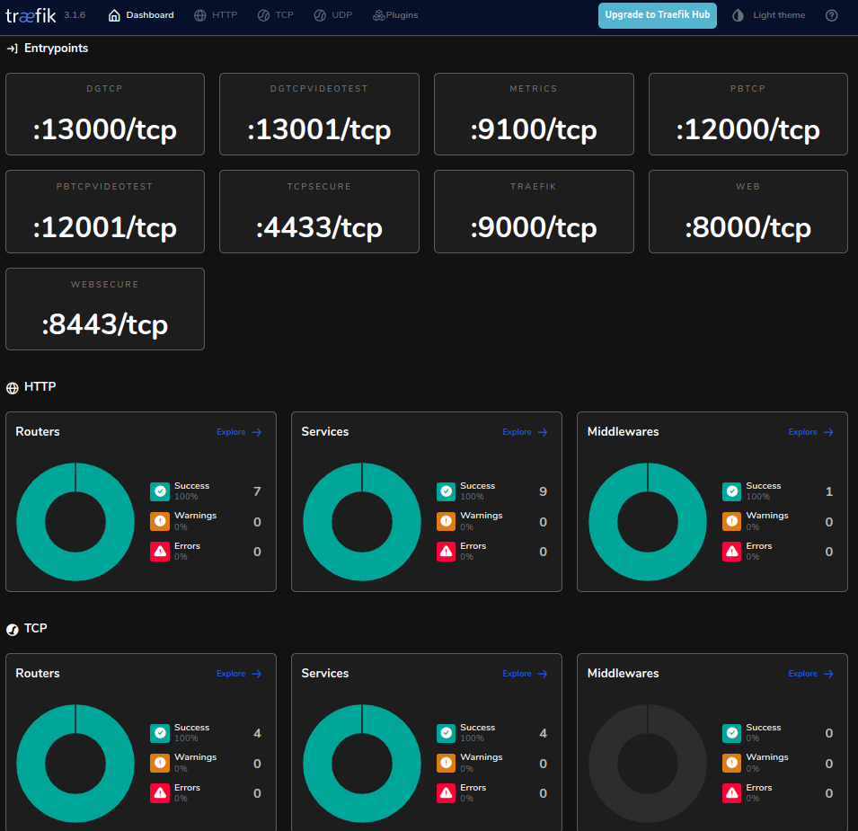
Entrypoints activos y salud de routers/services/middlewares, HTTP y TCP.

</td>
<td width="50%">

**Traefik — HTTP Routers**
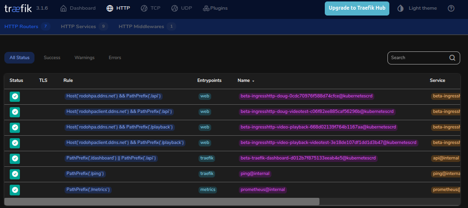
Las reglas de enrutamiento por `Host` + `PathPrefix` en vivo.

</td>
</tr>
<tr>
<td width="50%">

**Traefik — TCP Routers**
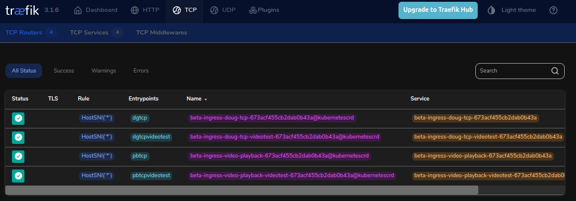
Un entrypoint TCP dedicado por servicio/variante.

</td>
<td width="50%">

**Prometheus — Target health**
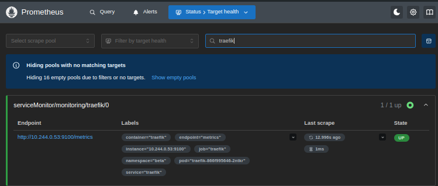
El scrape del `ServiceMonitor` de Traefik, `UP`.

</td>
</tr>
<tr>
<td width="50%">

**Prometheus — Conexiones TCP**
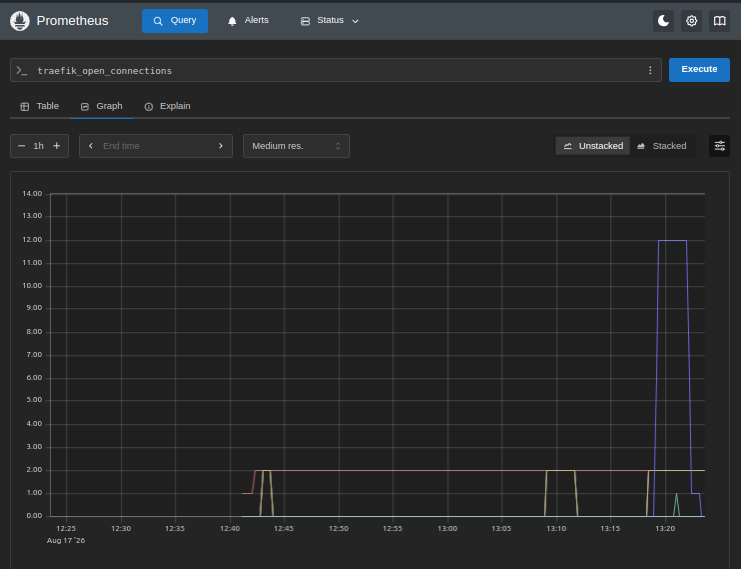
`traefik_open_connections` en vivo mientras se generan conexiones de prueba.

</td>
<td width="50%">

**Prometheus — Tasa de requests HTTP**
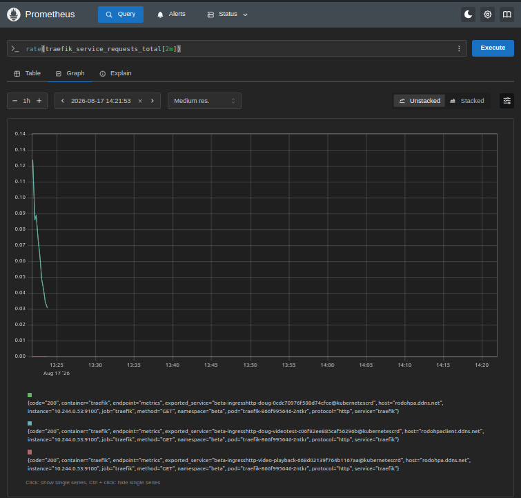
`rate(traefik_service_requests_total[2m])` por host.

</td>
</tr>
<tr>
<td width="50%">

**Prometheus — Alerta disparada**
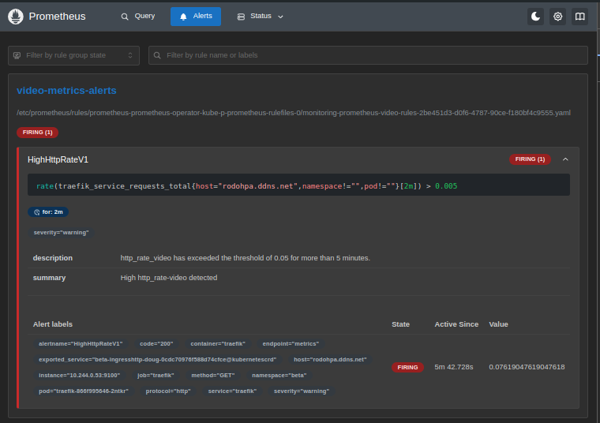
`HighHttpRateV1` en estado `FIRING`, con el PromQL exacto que la dispara.

</td>
<td width="50%">

**Alertmanager — Notificación**
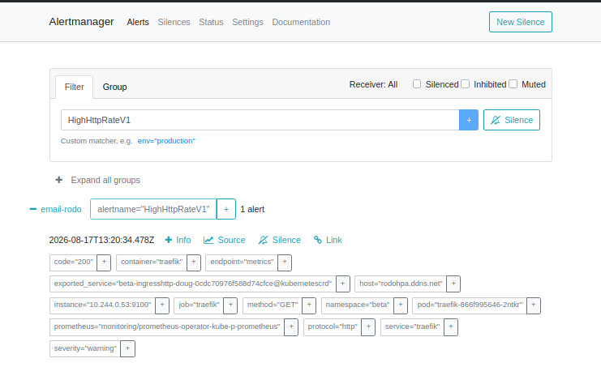
La misma alerta, ya rateada al receiver de email.

</td>
</tr>
<tr>
<td width="50%">

**CLI — HPA en vivo**
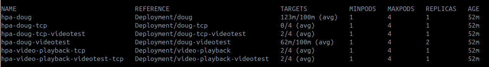
`kubectl get hpa` mostrando valores reales (no `<unknown>`) y réplicas escalando.

</td>
<td width="50%">

**CLI — Menú interactivo**
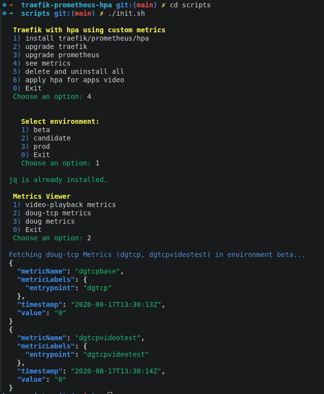
`scripts/init.sh`: instalar, ver métricas, borrar, todo desde un menú.

</td>
</tr>
</table>

## Características principales

- 🔀 **Enrutamiento HTTP y TCP nativo** con el mismo Ingress Controller (Traefik), sin componentes extra.
- 📈 **Autoescalado por métricas de negocio** — requests por segundo y conexiones TCP simultáneas — en vez de CPU/memoria.
- 🧩 **Tres patrones de servicio cubiertos**: solo HTTP, solo TCP, y HTTP+TCP combinados en un mismo pod, para comparar cómo se comporta el HPA en cada caso.
- 🏢 **Esquema multi-instancia**: cada servicio tiene una instancia base (corporativa) y una instancia de cliente aislada, sobre la misma infraestructura.
- 🔔 **Alertas con notificación real por email** cuando el tráfico supera un umbral (Prometheus + Alertmanager + SMTP).
- 🖥️ **CLI interactiva** (`scripts/init.sh`) para instalar, actualizar, inspeccionar métricas y desinstalar todo el stack.
- 🌍 **Multi-ambiente** (`beta` / `candidate` / `prod`) sobre el mismo cluster, aislado por namespace.
- 🧪 **Script de generación de tráfico** incluido para reproducir el comportamiento end-to-end sin depender de tráfico externo.

## Stack tecnológico

| Tecnología | Versión | Uso |
|---|---|---|
| Kubernetes | 1.29+ (probado en GKE y `kind`) | Orquestación del cluster |
| Helm | 3.15+ | Gestión de los charts de Traefik y Prometheus |
| Traefik | chart `32.1.1` / app `v3.1.6` | Ingress Controller HTTP + TCP, emisor de métricas Prometheus |
| kube-prometheus-stack | — | Prometheus Operator + Alertmanager, vía CRDs `ServiceMonitor`/`PrometheusRule` |
| prometheus-adapter | `v0.12.0` | Traduce PromQL a la Kubernetes External Metrics API |
| Bash | — | Automatización de instalación, borrado y pruebas |
| jq | — | Parseo de JSON en la CLI |

> La versión de Traefik está fijada explícitamente en el script de instalación: el `values.yaml` usa campos que versiones de chart más nuevas ya no aceptan, así que se pinea para evitar romperse al traer "la última" versión del repo de Helm.

## Arquitectura

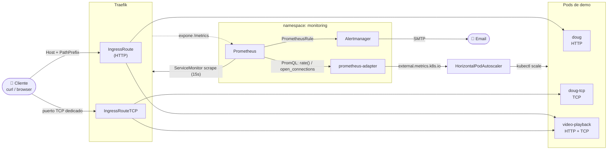
```mermaid
flowchart LR
    C(["🧑 Cliente<br/>curl / browser"])

    subgraph TR["Traefik"]
        IR["IngressRoute<br/>(HTTP)"]
        IRT["IngressRouteTCP"]
    end

    subgraph APPS["Pods de demo"]
        A1["doug<br/>HTTP"]
        A2["doug-tcp<br/>TCP"]
        A3["video-playback<br/>HTTP + TCP"]
    end

    subgraph MON["namespace: monitoring"]
        P["Prometheus"]
        PA["prometheus-adapter"]
        AM["Alertmanager"]
    end

    HPA["HorizontalPodAutoscaler"]
    MAIL(["📧 Email"])

    C -- "Host + PathPrefix" --> IR --> A1
    IR --> A3
    C -- "puerto TCP dedicado" --> IRT --> A2
    IRT --> A3

    TR -. "expone /metrics" .-> P
    P -- "ServiceMonitor scrape (15s)" --> TR
    P -- "PromQL: rate() / open_connections" --> PA
    PA -- "external.metrics.k8s.io" --> HPA
    HPA -- "kubectl scale" --> APPS

    P -- "PrometheusRule" --> AM
    AM -- "SMTP" --> MAIL
```

**Ciclo de un request HTTP**, desde que llega hasta que puede afectar al HPA:

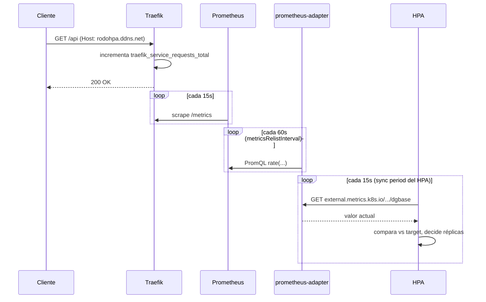
```mermaid
sequenceDiagram
    participant Cliente
    participant Traefik
    participant Prometheus
    participant Adapter as prometheus-adapter
    participant HPA

    Cliente->>Traefik: GET /api (Host: rodohpa.ddns.net)
    Traefik->>Traefik: incrementa traefik_service_requests_total
    Traefik-->>Cliente: 200 OK

    loop cada 15s
        Prometheus->>Traefik: scrape /metrics
    end
    loop cada 60s (metricsRelistInterval)
        Adapter->>Prometheus: PromQL rate(...)
    end
    loop cada 15s (sync period del HPA)
        HPA->>Adapter: GET external.metrics.k8s.io/.../dgbase
        Adapter-->>HPA: valor actual
        HPA->>HPA: compara vs target, decide réplicas
    end
```

## Métricas expuestas

Este proyecto no tiene una API REST propia — lo que expone es una **API de métricas de Kubernetes** (`external.metrics.k8s.io`), que es lo que consume cada HPA. Son 8 métricas en total:

| Métrica | Tipo | Servicio | HPA que la lee |
|---|---|---|---|
| `dgbase` / `dgvideotest` | HTTP (tasa de requests) | `doug` (base / cliente) | `hpa-doug` / `hpa-doug-videotest` |
| `dgtcpbase` / `dgtcpvideotest` | TCP (conexiones abiertas) | `doug-tcp` (base / cliente) | `hpa-doug-tcp` / `hpa-doug-tcp-videotest` |
| `pbtcpbase` / `pbtcpvideotest` | TCP (conexiones abiertas) | `video-playback` (base / cliente) | `hpa-video-playback-tcp` / `hpa-video-playback-videotest-tcp` |
| `pbbase` / `pbvideotest` | HTTP (tasa de requests) | `video-playback` (base / cliente) | *(disponible, sin HPA propio)* |

Referencia completa con el PromQL de cada una en **[`docs/metrics-reference.md`](docs/metrics-reference.md)**.

## Estructura del proyecto

```text
.
├── 0-configmap/         # Reglas PromQL del prometheus-adapter (una por métrica HTTP/TCP)
├── 1-helm-values/        # values.yaml de Traefik, kube-prometheus-stack y prometheus-adapter
├── 2-apiservice/         # APIService de external.metrics.k8s.io, pre-registrado antes del primer install
├── 3-middleware/         # Middleware de Traefik (rate limiting sobre las rutas HTTP)
├── 4-ingress/            # IngressRoute (HTTP) e IngressRouteTCP (TCP)
├── 5-hpa/                 # Un HorizontalPodAutoscaler por Deployment
├── 6-app/                 # 3 servicios de demo, cada uno con instancia base + cliente
│   ├── doug/               #   Solo HTTP
│   ├── doug-tcp/           #   Solo TCP
│   └── video-playback/     #   HTTP + TCP en el mismo pod
├── 7-rules/               # PrometheusRule: alerta por tasa de requests HTTP
├── docs/                   # Diagramas y capturas usadas en este README
├── scripts/                # CLI de instalación, borrado, métricas y generación de tráfico
├── LICENSE
└── README.md
```

## Instalación y uso

### Requisitos previos

- `kubectl` y `helm` (3.15+)
- `jq` (la CLI lo instala solo si falta)
- Un cluster de Kubernetes: **GKE** real, o **`kind`** para probar en local
- Si es GKE: `gcloud` autenticado y con `kubectl` apuntando al contexto correcto

### 1. Clonar el repositorio

```bash
git clone https://github.com/RodolGiaco/traefik-prometheus-hpa
cd traefik-prometheus-hpa
```

### 2. Levantar el cluster (elegí una opción)

**Opción A — cluster local con `kind`** (para probar todo el flujo sin infraestructura real):
```bash
chmod +x scripts/init.sh
./scripts/init.sh
# elegí 7) create local kind cluster
```

**Opción B — GKE real**: apuntá tu `kubectl` al contexto del cluster (`kubectl config use-context <contexto>`).

### 3. Instalar Traefik + Prometheus + HPA

```bash
./scripts/init.sh
```

Elegí `1) install traefik/prometheus/hpa` y después el ambiente (`beta`/`candidate`/`prod` — son namespaces, no clusters distintos; el namespace se crea solo si todavía no existe). El script instala Traefik, Prometheus + Alertmanager + prometheus-adapter, y aplica los HPA y los pods de demo.

> El menú de `init.sh` también tiene `8) delete local kind cluster`, para tirar abajo el cluster de prueba entero cuando termines (además de `5) delete and uninstall all`, que solo desinstala lo que se aplicó adentro, sin tocar el cluster).

### 4. Mapear los dominios de prueba (solo para `kind` local)

Como en `kind` no hay un LoadBalancer real, se accede vía la IP del nodo + el `nodePort` que le asigna Kubernetes. Los dominios de ejemplo (`rodohpa.ddns.net`, `rodohpaclient.ddns.net`) son dominios gratuitos creados en [No-IP](https://www.noip.com/) — para reproducir el comportamiento real de un `Host` header hay que mapearlos a la IP del nodo en tu `/etc/hosts`:

```bash
NODE_IP=$(kubectl get nodes -o jsonpath='{.items[0].status.addresses[?(@.type=="InternalIP")].address}')
echo "$NODE_IP rodohpa.ddns.net" | sudo tee -a /etc/hosts
echo "$NODE_IP rodohpaclient.ddns.net" | sudo tee -a /etc/hosts
```

### 5. Generar tráfico de prueba

```bash
./scripts/gen_traffic_doug.sh
```

Manda requests HTTP cada 1s y abre conexiones TCP persistentes contra los servicios de demo — esto es lo que hace que el HPA deje de mostrar `<unknown>` y empiece a leer valores reales.

### 6. Ver el HPA escalando en vivo

```bash
kubectl get hpa -n beta -w
```

### 7. Ver los dashboards

```bash
# Traefik
kubectl port-forward -n beta $(kubectl get pods -n beta -l app.kubernetes.io/name=traefik -o jsonpath="{.items[0].metadata.name}") 9000:9000
# -> http://localhost:9000/dashboard/

# Prometheus
kubectl port-forward -n monitoring svc/prometheus-operated 9090:9090
# -> http://localhost:9090

# Alertmanager
kubectl port-forward -n monitoring svc/prometheus-operator-kube-p-alertmanager 9093:9093
# -> http://localhost:9093
```

### 8. Ver las métricas personalizadas por CLI

```bash
./scripts/external_metrics.sh beta
```

Menú interactivo para consultar directamente `external.metrics.k8s.io` — 8 métricas expuestas por el adapter: `dgbase`, `dgvideotest`, `dgtcpbase`, `dgtcpvideotest`, `pbtcpbase`, `pbtcpvideotest` tienen un HPA activo leyéndolas; `pbbase` y `pbvideotest` (tasa de HTTP para `video-playback`) quedan definidas y disponibles para conectarse a un HPA propio si se necesita escalar ese servicio también por ese eje.

## Decisiones técnicas

**¿Por qué Traefik y no otro Ingress Controller?** Expone métricas de Prometheus nativas por router, servicio y entrypoint sin necesitar un exporter adicional, y soporta enrutamiento TCP nativo (`IngressRouteTCP`) además de HTTP — necesario para poder demostrar escalado por conexiones TCP y no solo por requests HTTP con el mismo controlador.

**¿Por qué `prometheus-adapter` y no KEDA u otra alternativa?** Para mostrar el mecanismo estándar de Kubernetes (`external.metrics.k8s.io`) sin depender de un operador de terceros — el pipeline completo PromQL → API de métricas → HPA queda explícito y es portable a cualquier cluster con Prometheus Operator.

**¿Por qué tres servicios de demo separados en vez de uno solo?** Cada uno cubre un patrón de tráfico distinto (solo HTTP, solo TCP, HTTP+TCP combinado) para poder comparar cómo se comporta el autoescalado en cada caso. Un mismo Deployment solo puede ser el `scaleTargetRef` de **un único HPA** — si un servicio necesita escalar por dos métricas a la vez (por ejemplo HTTP y TCP), esas métricas tienen que convivir como dos entradas dentro del *mismo* objeto HPA, no en dos HPA separados.

**¿Por qué un ConfigMap con reglas PromQL en vez de anotaciones o un CRD de métricas?** `prometheus-adapter` resuelve `externalRules` declarativas contra Prometheus en tiempo de consulta — permite ajustar el PromQL (filtros, agregaciones, ventanas de `rate()`) sin tocar código ni recompilar nada, y versionarlo junto con el resto del cluster.

**¿Por qué namespaces por ambiente en vez de releases de Helm separados?** Mantiene un único release de Traefik/Prometheus reusable por ambiente, aislando `beta`/`candidate`/`prod` por namespace en vez de multiplicar instalaciones completas del stack.

## Documentación adicional

- **[`docs/metrics-reference.md`](docs/metrics-reference.md)** — tabla completa de las 8 métricas personalizadas, con el PromQL exacto de cada una.
- **[`docs/troubleshooting.md`](docs/troubleshooting.md)** — comportamientos no evidentes de Traefik/Prometheus/`prometheus-adapter` que conviene conocer antes de tocar la configuración (límite de un HPA por Deployment, timing del descubrimiento de métricas, etc.).

## Autor y contacto

**Rodolfo Giacomodonatto**
GitHub: [@RodolGiaco](https://github.com/RodolGiaco)

---

<div align="center">
<sub>Licenciado bajo <a href="LICENSE">MIT</a>.</sub>
</div>
